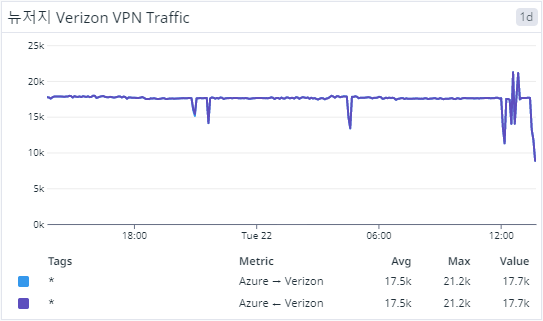

# Datadog Dashboard for Azure VPN per Site

## 대시보드 구성 대상: 사전 구성된 내역
1. Azure Virtual WANs 구성 후
2. HUB 생성 및 VPN(Site to Site) 생성
3. VPN Sites 생성하여 Link(Customer VPN) 등록
4. Customer VPN과 연결(Connected) 상태

## Datadog: Azure Integration

## Datadog: Dashboard Graph

# Datadog: Dashboard Settings

